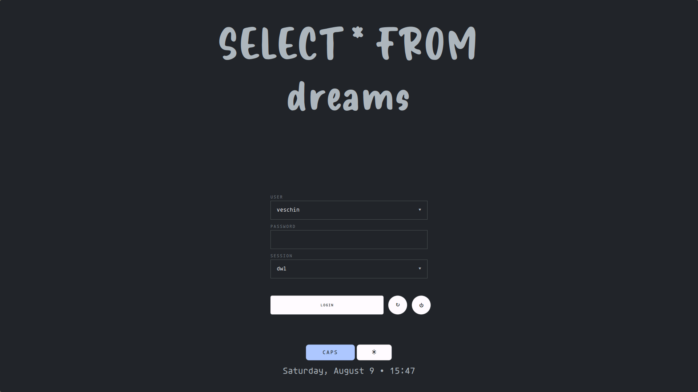

# Nibelung SDDM Theme

A minimalist and clean SDDM theme with user selection, session picker, and theme switching.



Based on the original [Nibelung Theme](https://github.com/veschin/nibelung-theme).

## One-line Installation

```bash
sudo bash -c "$(curl -sSL https://raw.githubusercontent.com/veschin/nibelung-sddm-theme/main/install.sh)"
```

## Manual Installation

1. Clone the repository:
```bash
git clone https://github.com/veschin/nibelung-sddm-theme.git
cd nibelung-sddm-theme
```

2. Install the theme:
```bash
sudo cp -r . /usr/share/sddm/themes/nibelung
```

3. Set as current theme in `/etc/sddm.conf`:
```ini
[Theme]
Current=nibelung
```

## Features

- User selection dropdown
- Session picker  
- Dark/Light theme toggle
- Responsive design
- Custom fonts included

## Requirements

- SDDM with Qt 5.15+
